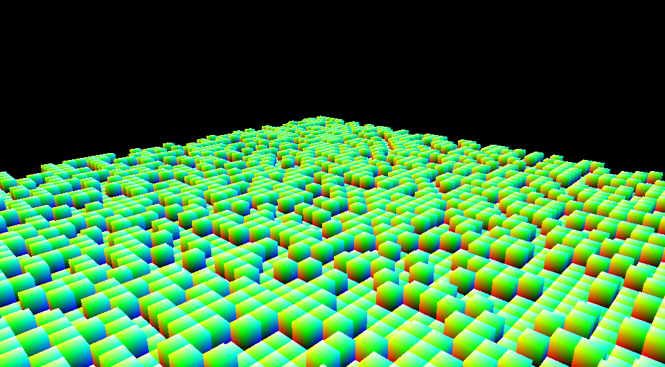
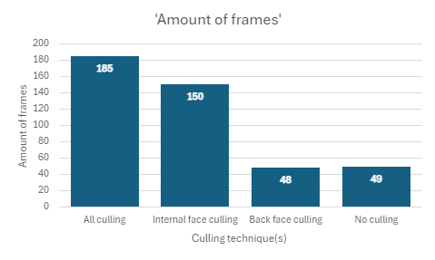
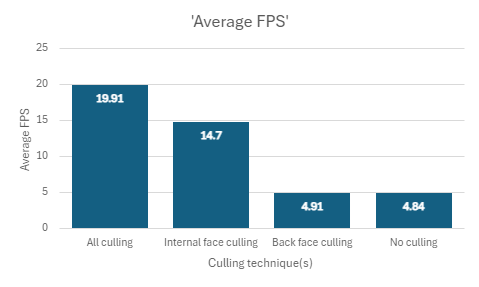
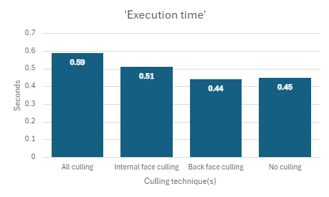

# BuildScape

## Introduction
This is a simple voxel renderer written with C++ using OpenGL. This was a project to evaluate different culling techniques, namely internal face culling and backface culling, and how those culling techniques impact the performance of the program. 
This project is based off of other voxel renderers like Minecraft, Teardown, and Crystal Islands. While Minecraft is fairly tame with its voxels, it is also notoriously badly optimized. But if you look at Teardown and Crystal Islands, their voxels are insanely small, and still the renderers manage to run at an acceptable FPS. 
These renderers use a multitude of culling techniques to ensure the GPU can handle the workload. This inspired me to start working on my own voxel renderer and explore some of these culling techniques. 
With enough time and motivation, I might turn this into something you can actually play. Before that, there are many things that need to be fixed. (Better way of drawing, shader file reading, frustum culling, draw calls for entire chunks, etc.)

## Culling techniques
### Internal face culling
Because we're working with a voxel editor, it allows us to implement a unique culling technique, that being internal face culling. Voxels are sure to touch at some point in any voxel game, and any time this happens, there are four triangles being rendered but not being shown. 
The way I ignore those triangles is by having the voxels store which faces to show and which to hide. This is decided once, at the start of the program. Then, whenever a voxel needs to be rendered, it will check which faces to render and adjust it's indices based on that data.

### Back face culling
Back face culling is not specific to voxel renderers, but we can handle it differently. Usually, triangles are only rendered if their vertices are ordered in a clockwise fashion, but we know that a voxel only ever has three sides that a camera can see. 
That means we only need to compare a voxel's position with the camera's position. If the voxel is, for example, lower than the camera's position, there's no need to draw the bottom of that voxel. 
Doing it on a voxel-by-voxel basis is quite intensive though, so instead it's done on a chunk-by-chunk basis. This does mean that we're sometimes rendering triangles that camera can't see, and that we must render all triangles of the chunk we're currently in. 
In the tests conducted below, it should be noted that 'no culling techniques' does not mean no performance boosts. There are multiple techniques to ensure the program runs at least a bit smoothly, most of which have to do with how voxel data is stored.

## Analysis
### Hardware
- GPU: NVIDIA GeForce RTX 3060
- CPU: AMD Ryzen 7 5800H
- RAM: 16 GB

### OpenGL version
- Version: 4.6.0 NVIDIA 546.80

### Testing
The way these tests were done is by having the program move over the generated voxels for a given amount of time. During this time, the amount of frames is being counted, and the FPS is being added up. Then, at the end, the FPS is divided by the amount of frames. For accurate results, testing should be done only after the FPS has gotten to a stable point. Because of the way it's being calculated, the shown FPS starts high and needs about 15 seconds to get to its actual value. 
I've also recorded the execution time, which is how long the program takes to get from the start of main to the game loop, in seconds. All of the gathered information is an average of five tests. 
To make testing easier, there's a debug window. This window shows the user different keybinds, like how to reset the camera's position, lock the camera, or look at the wireframes of the voxels. It also has two buttons for enabling and disabling the two culling techniques. Additionally, it shows the current FPS.

### Charts
#### Chart 1 & 2: Frames/FPS

 
This is what I got from testing with my hardware. It's nothing crazy, but definitely shows that the two implemented culling techniques have a significant impact on the performance of the program. 
One thing to note is that back face culling barely has any effect on the performance on its own. If anything, it's slightly slower, though that's negligible. Yet, when put together with the internal face culling, it results in a significant boost of 5 FPS. This makes sense, as internal face culling greatly reduces the amount of voxels to apply backface culling to. This means that just using backface culling on its own means you have to check which faces to draw more often, even when its done on a chunk-by-chunk basis.

#### Chart 3: Execution time
 
The execution time chart gives more context to the performance gains with the culling techniques enabled, or rather how much it slows the start of the program down. With all culling techniques, or lack thereof, the execution time is about the same, with the difference between the two extremes being 0.15 seconds. This means that enabling the culling techniques, internal face culling to be precise, has little to no impact on the execution time.
Moreover, the overall consistency in execution time across the differect culling techniques suggests that the overhead created by these techniques is manageable. This stability is important if this were to be a program useable by people.

## Conclusion
We can conclude from the data that there is a significant boost in FPS when both culling techniques are used, all while execution time is kept to a minimum. This combination makes the program suitable for practical use, especially if more performance boosting techniques are used. 
Internal face culling proved to be detrimental for the performance of the program, boosting it majorly by removing the need to render hidden triangles. While back face culling seems to not have much impact on its own, it shows a significant difference in FPS when paired with internal face culling. 
As for execution time, the fact that it mostly stayed the same regardless of which rendering techniques were used promises good results if I were to work on this further. 

## References
The Cherno. (2017, September 17). Welcome to OpenGL [Video]. YouTube. https://www.youtube.com/watch?v=W3gAzLwfIP0 
Learn OpenGL, extensive tutorial resource for learning Modern OpenGL. (n.d.). https://learnopengl.com/ 
Vercidium. (2024, March 17). I Optimised My Game Engine Up To 12000 FPS [Video]. YouTube. https://www.youtube.com/watch?v=40JzyaOYJeY 
